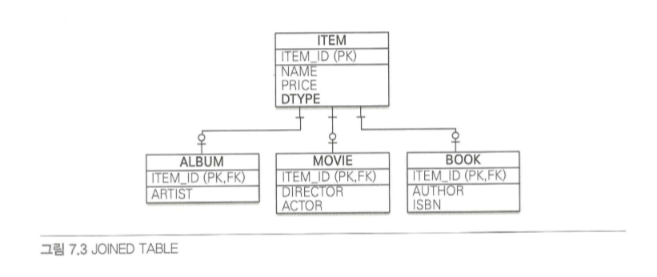
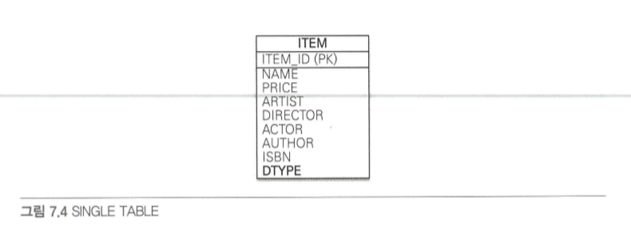
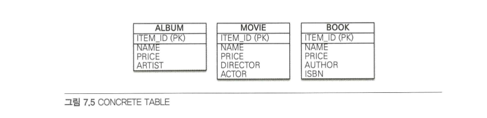
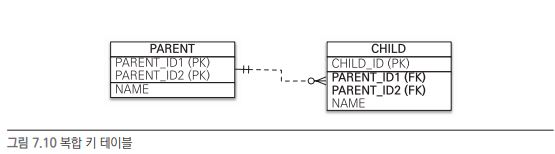
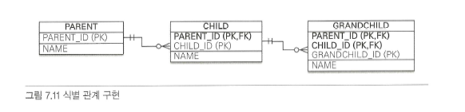
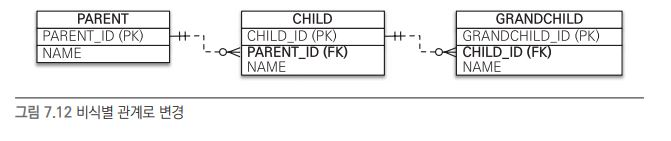
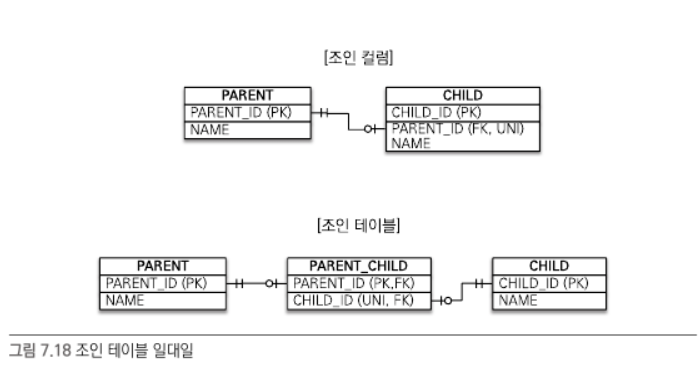
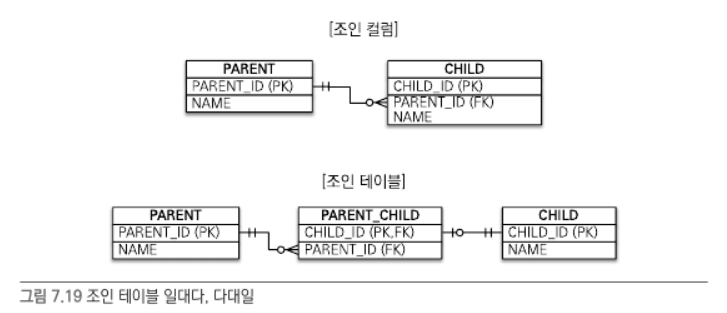
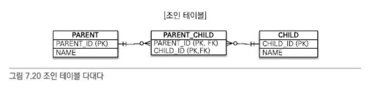
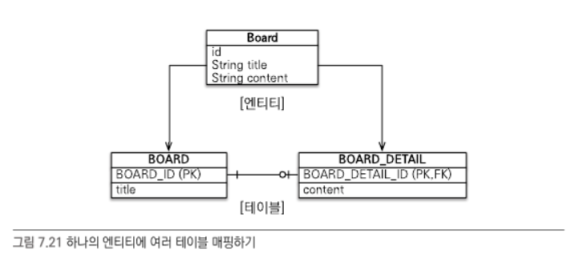

## 상속관계 매핑

관계형 데이터베이스에는 객체지향 언어에서 다루는 상속이라는 개념이 없다. 대신 슈퍼 타입 - 서브타입 관계라는 모델링 기법이 객체의 상속 개념과 
가장 유사하다. 

이런 슈퍼타입 - 서브타입 논리 모델을 실제 물리 모델인 테이블로 구현할 때에는 3가지 방법이 있다.
- 각각 테이블로 변환 : 조회 할 때에 조인을 사용한다. (슈퍼 타입 테이블 PK를 서브 타입 테이블의 PK로 넣어줌) / JPA에서는 조인 전략이라 한다.
- 통합 테이블로 변환 : 테이블을 하나만 사용해서 통합한다. (걍 다 때려박기) / JPA에서는 단일 테이블 전략이라 한다.
- 서브타입 테이블로 변환 : 서브타입마다 하나의 테이블을 만든다. / JPA에서는 구현클래스 마다 테이블 전략이라 한다.

### 조인 전략

엔티티 각각 모두 테이블로 만들고 자식 테이블이 부모 테이블의 기본키를 받아서 기본키 + 외래 키로 사용하는 전략이다.
조회할 때에 조인을 자주 사용한다. 테이블은 참고로 조인을 하기 때문에 어떤 타입인지 알 수 있는 방법이 없다. 따라서 DTYPE을 따로 넣어준다.



```java
import javax.persistence.Column;
import javax.persistence.DiscriminatorColumn;
import javax.persistence.DiscriminatorValue;
import javax.persistence.Entity;
import javax.persistence.GeneratedValue;
import javax.persistence.Id;
import javax.persistence.Inheritance;
import javax.persistence.InheritanceType;

@Entity
@Inheritance(strategy = InheritanceType.JOINED) // 상속 매핑은 부모클래스의 @Inheritance 를 사용해야한다. 
@DiscriminatorColumn(name = "DTYPE") // 부모 클래스에 구분 컬럼을 지정한다. 이 컬럼으로 지정된 자식 테이블을 구분한다.
public abstract class Item {

    @Id
    @GeneratedValue
    @Column(name = "ITEM_ID")
    private Long id;

    private String name;
    private int price;
}

@Entity
@DiscriminatorValue("A") // 엔티티를 저장할 때 구분 칼럼에 입력할 값을 지정한다. 
public class Album extends Item {
    private String artist;
}

@Entity
@DiscriminatorValue("M")
public class Movie extends Item {
    private String director;
    private String actor;
}
```

기본적으로 자식테이블은 부모 테이블의 ID 칼럼명을 그대로 사용하는데 만약 자식 테이블의 기본키 컬럼명을 변경하고 싶다면 다음과 같이 하면 된다.

```java
import javax.persistence.DiscriminatorValue;
import javax.persistence.Entity;
import javax.persistence.PrimaryKeyJoinColumn;

@Entity
@DiscriminatorValue("B")
@PrimaryKeyJoinColumn(name = "BOOK_ID")
public class Book extends Item {
    private String author;
    private String isbn;
}
```

**장점**
- 테이블이 정규화 된다
- 외래키 참조 무결성 제약 조건을 활용 할 수 있다.
- 저장공간을 효율적으로 사용한다.

**단점**
- 조회 할 때 조인이 많이 사용되므로 성능이 저하될 수 있다.
- 조회 쿼리가 복잡하다
- 데이터를 등록할 때에 INSERT SQL 을 두 번 실행한다.


### 단일 테이블 전략 

테이블 하나만 사용한다. 조인을 사용하지 않으므로 일반적으로 가장 빠르다.



주의 해야할 점은 자식 엔티티가 매핑한 칼럼은 모두 null 을 허용해야 한다는 점이다.

```java

import javax.persistence.Column;
import javax.persistence.DiscriminatorColumn;
import javax.persistence.DiscriminatorValue;
import javax.persistence.Entity;
import javax.persistence.Id;
import javax.persistence.Inheritance;
import javax.persistence.InheritanceType;

@Entity
@Inheritance(strategy = InheritanceType.SINGLE_TABLE)
@DiscriminatorColumn(name = "DTYPE")
public abstract class Item {

    @Id
    @Column(name = "ITEM_ID")
    private Long id;

    private String name;
    private int price;
}

@Entity
@DiscriminatorValue("A")
public class Album extends Item { ... }

@Entity
@DiscriminatorValue("M")
public class Moive extends Item { ... }

@Entity
@DiscriminatorValue("B")
public class Book extends Item { ... }
```

**장점**
- 조인이 필요 없으므로 조회 성능 굿
- 조회 쿼리 단순

**단점**
- 자식 엔티티가 매핑한 칼럼은 모두 null을 허용해야 한다.
- 단일 테이블에 모든 것을 저장하므로 테이블이 커질 수 있다. 오히려 상황에 따라 느려지기도 가능

구분 컬럼을 반드시 사용해야한다. @DiscriminatorColumn 을 꼭 설정해야한다.

### 구현 클래스마다 테이블 전략



자식 엔티티 마다 테이블을 만든다. 그리고 각 자식에 각각 필요한 칼럼이 있다.

```java
import javax.persistence.Column;
import javax.persistence.Entity;
import javax.persistence.GeneratedValue;
import javax.persistence.Id;
import javax.persistence.Inheritance;
import javax.persistence.InheritanceType;

@Entity
@Inheritance(strategy = InheritanceType.TABLE_PER_CLASS)
public abstract class Item {

    @Id
    @GeneratedValue
    @Column(name = "ITEM_ID")
    private Long id;
    
    private String name;
    private int price;
}

@Entity
public class Album extends Item { ... }
@Entity
public class Movie extends Item { ... }
@Entity
public class Book extends Item { ... }
```

일반적으로 추천하지 않는 전략이다. 

**장점**
- 서브 타입을 구분해서 처리할 때 효과적이다.
- not null 제약 조건을 사용할 수 있다.
**단점**
- 여러 자식 테이블을 함께 조회할 때 성능이 느리다. 
- 자식테이블을 통합해서 쿼리하기 어렵다.

특징으로는 구분 컬럼이 없다. 이 전략은 db 설계자와 ORM 모두 추천하지 않는 전략이다. 조인이나 단일 전략을 고려하자

## @MappedSuperclass

위 매핑은 무보 클래스와 자식 클래스를 모두 데이터 베이스 테이블과 매핑했다. 부모 클래스는 테이블이랑 매핑하지 않고 부모 클래스를 상속 받는
자식 클래스에게 매핑 정보만 제공하고 싶으면 @MappedSuperclass를 사용하면 된다.

```java
import javax.persistence.Entity;
import javax.persistence.GeneratedValue;
import javax.persistence.Id;
import javax.persistence.MappedSuperclass;

@MappedSuperclass
public abstract class BaseEntity {

    @Id
    @GeneratedValue
    private Long id;
    private String name;
}

@Entity
public class Member extends BaseEntity {
    private String name;
}

@Entity
public class Seller extends BaseEntity {
    private String shopName;
}
```

부모로부터 물려받은 매핑 정보를 재정의 하려면 @AttributeOverrides 나 @AttributeOverride를 사용하고
연관관계를 재정의하려면 @AssociationOverrides 나 @AssociationOverride를 사용한다.

```java
import javax.persistence.AssociationOverride;
import javax.persistence.Column;
import javax.persistence.Entity;

@Entity
@AssociationOverride(name = "id", column = @Column(name="MEMBER_ID"))
public class Member extends BaseEntity {
    
}
```

이런식으로 재정의 하면 되고 여러개일 때는 @AttributeOverrides 를 사용하면 된다.

특징은 다음과 같다
- 테이블과 매핑되지 않고 자식 클래스에 엔티티의 매핑 정보를 상속하기 위해 사용한다.
- @MappedSuperclass 로 지정한 클래스는 엔티티가 아니므로 em.find() 나 JPQL 에서는 사용 불가
- 이 클래스를 직접 생성해서 사용할 일이 거의 없으므로 추상 클래스로 만드는 것을 추천

@MappedSuperclass는 테이블과는 관계가 없고 단순히 엔티티가 공통으로 사용하는 매핑 정보를 모아주는 역할을 한다.

## 복합 키와 식별 관계 매핑

### 식별관계 vs 비식별 관계

데이터베이스 테이블 사이에 관계는 외래키가 기본 키에 포함되는지 여부에 따라 식별 관계와 비식별 관계로 구분한다.

- 식별 관계 : 부모 테이블의 기본키를 내려 받아서 자식테이블의 기본 키 + 외래 키로 사용하는 관계
- 비식별 관계 : 부모 테이블의 기본키를 받아서 자식 테이블의 외래 키로만 사용하는 관계
  - 필수적 비식별 관계 : 외래키에 NULL을 허용하지 않는다. 연관관계를 필수적으로 맺어야한다.
  - 선택적 비식별 관계 : 외래키에 NULL 허용

### 복합 키 : 비식별 관계 매핑

둘 이상의 칼럼으로 구성된 복합키는 별도의 식별자 클래스를 만들어야 한다. 식별자를 구분하기 위해 equals와 hashCode를 사용해서 동등성 비교를한다.
복합키를 만드려면 @IdClass 와 @EmbeddedId 2가지 방법을 제공한다.

@IdClass



```java
import java.io.Serializable;
import javax.persistence.Column;
import javax.persistence.Entity;
import javax.persistence.Id;
import javax.persistence.IdClass;

@Entity
@IdClass(ParentId.class)
public class Parent {

  @Id
  @Column(name = "PARENT_ID1")
  private String id1;

  @Id
  @Column(name = "PARENT_ID2")
  private String id2;

  private String name;
}

@EqualsAndHashCode
public class ParentId implements Serializable {
    private String id1;
    private String id2;
}
```

IdClass 는 다음 조건을 만족해야 한다.
- 식별자 클래스의 속성명과 엔티티에서 사용하는 식별자의 속성명이 같아야한다.
- Serializable 인터페이스를 구현해야한다.
- 기본 생성자가 있어야한다.
- 식별자 클래스는 public 이어야 한다.

이제 식별자 클래스인 ParentId 를 자식클래스에 추가해보자

```java
import javax.persistence.Entity;
import javax.persistence.Id;
import javax.persistence.JoinColumn;
import javax.persistence.ManyToOne;

@Entity
public class Child {

  @Id
  private String id;

  @ManyToOne
  @JoinColumn(
          {
                  @JoinColumn(name = "PARENT_ID1", referencedColumnName = "PARENT_ID1"),
                  @JoinColumn(name = "PARENT_ID2", referencedColumnName = "PARENT_ID2")
          })
  private Parent parent;
}
```

자식 테이블의 외래키도 복합키이다. 


@EmbeddedId

```java
import java.io.Serializable;
import javax.persistence.Column;
import javax.persistence.Embeddable;
import javax.persistence.EmbeddedId;
import javax.persistence.Entity;

@Entity
public class Parent {

  @EmbeddedId
  private ParentId id;

  private String name;
}

@Embeddable
@EqualsAndHashCode
public class ParentId implements Serializable {

  @Column(name = "PARENT_ID1")
  private String id1;
  
  @Column(name = "PARENT_ID2")
  private String id2;
}
```

EmbeddedId 는 다음과 같은 조건을 만족해야 한다.
- @Embeddable 어노테이션을 붙여줘야 한다.
- Serializable 인터페이스를 구현해야 한다.
- equal, hashCode 를 구현해야 한다.
- 기본 생성자가 있어야한다.
- 식별자 클래스는 public 이어야 한다.

### 복합 키 : 식별 관계 매핑



부모, 자식, 손자까지 기본키를 전달하는 식별 관계이다.

@IdClass 와 식별관계
```java
// 부모
@Entity
public class Parent {

    @Id
    @Column(name = "PARENT_ID")
    private String id;
    
    private String name;
}

// 자식
@Entity
@IdClass(ChildId.class)
public class Child {
	
    @Id
    @Column(name = "CHILD_ID")
    private String id;
    
    @Id
    @ManyToOne
    @JoinColumn(name = "PARENT_ID")
    private Parent parent;
}

// 자식 ID
public class ChildId implements Serializable {
    
    private String id;
    private String parent;
    
    // equals, hashCode
}

// 손자
@Entity
@IdClass(GrandChildId.class)
public class GrandChild {

    @Id
    @Column(name = "GRANDCHILD_ID")
    private String id;
    
    @Id
    @ManyToOne
    @JoinColumns({
      @JoinColumn(name = "PARENT_ID, referencedColumnName = "PARENT_ID")
      @JoinColumn(name = "CHILD_ID, referencedColumnName = "CHILD_ID")
    })
    private Child child;
}

// 손자 ID
public class GrandChildId implements Serializable {

    private String id;
    private ChildId child;
    
    // equals, hashCode
}

```

@EmbeddedId 와 식별 관계

@EmbeddedId 로 식별관계를 구성할 때는 @MapsId 를 사용해야 한다.

```java
// 부모
@Entity
public class Parent {

    @Id
    @Column(name = "PARENT_ID")
    private String id;
    
    private String name;
}

// 자식
public class Child {
	
    @EmbeddedId
    private ChildId id;
    
    @MapsId("parentId") // ChildId.parentId 매핑
    @ManyToOne
    @JoinColumn(name = "PARENT_ID")
    public Parent parent;
}

// 자식 ID
@Embeddable
public class ChildId implements Serializable {
	
    pirvate String parentId; // @MapsId("parentId")로 매핑
    
    @Column(name = "CHILD_ID")
    private String id;
    
    // equals, hashCode
}

// 손자
public class GrandChild {
	
    @EmbeddedId
    private GrandChildId id;
    
    @MapsId("childId") // GrandChildId.childId 매핑
    @ManyToOne
    @JoinColumns({
    	@JoinColumn(name = "PARENT_ID", referrencedColumnName = "PARENT_ID"),
        @JoinColumn(name = "CHILD_ID", referrencedColumnName = "CHILD_ID")
    })
    private Child child;
}

// 손자 ID
public class GrandChildId implements Serializable {
	
    private ChildId childId; // @MapsId("childId")로 매핑
    
    @Column(name = "GRANDCHILD_ID")
    private String id;
    
    // equals, hashCode
}

```

### 비식별 관계로 구현



```java
//부모
@Entity
public class Parent {
		@Id @GeneratedValue
		@Column(name = "PARENT_ID")
		private Long id;
		...
}

//자식
@Entity
public class Child {
		@Id @GeneratedValue
		@Column(name = "CHILD_ID")
		private Long id;
		private String name;
		
		@ManyToOne
		@JoinColumn(name = "PARENT_ID")
		private Parent parent;
		...
}

//손자
@Entity
public class GrandChild {
		@Id @GeneratedValue
		@Column(name = "GRANDCHILD_ID")
		private Long id;
		private String name;

		@ManyToOne
		@JoinColumn(name = "CHILD_ID")
		private Child child;
		...
}

```

복합키 클래스가 없어서 복잡하지 않다.

### 일대일 식별관계


```java
//부모
@Entity
public class Board {
		@Id @GeneratedValue
		@Column(name = "BOARD_ID")
		private Long id;
		private String title;

		@OneToOne(mappedBy = "board")
		private BoardDetail boardDetail;
		...
}

//자식
@Entity
public class BoardDetail {
		@Id
		private Long boardId;

		@MapsId //BoardDetail.boardId 매핑
		@OneToOne
		@JoinColumn(name = "BOARD_ID")
		private Board board;
		...
}
```

```java
// 일대일 식별 관계 저장
public void save() {
		Board board = new Board();
		board.setTitle("제목");
		em.persist(board);

		BoardDetail boardDetail = new BoardDetail();
		boardDetail.setContent("내용");
		boardDetail.setBoard(board);
		em.persist(boardDetail);
}
```

### 식별, 비식별 관계의 장단점

데이터베이스 설계 관점에서 보면 식별 관계보다는 비식별 관계를 선호한다.
- 식별 관계는 부모 테이블의 기본키를 자식 테이블로 전파하면서 기본키 칼럼이 늘어난다. 조인이 복잡해지고 기본키 인덱스가 너무 커진다.
- 식별 관계는 2개 이상의 컬럼을 합쳐놓은 복합키를 만들어야 하는 경우가 많다.
- 식별관계를 사용할 때에 기본키로 비지니스 의미가 있는 자연키 칼럼을 조합하는 경우가 많다. 하지만 비지니스는 언젠가는 변한다..
- 식별 관계는 부모 테이블의 기본 키를 자식 테이블의 기본키로 사용함으로 비식별보다 테이블 구조가 유연하지 못하다

객체 지향 관점에서 보면 다음과 같은 비식별 장점들이 있다
- 일대일 관계를 제외하고 식별관계는 2개이상의 컬럼을 묶은 복합 기본키를 사용한다. 복잡하다
- 대리키를 생성하는 데 편한데 굳이..?

식별이 가지는 장점으로는 기본키 인덱스 활용이 편하고 특정 상황에 조인 없이 하위 테이블만으로 검색이 가능하다.

이처럼 식별 관계가 가지는 장점이 있어서 꼭 필요한 곳에 적절하게 사용되면 좋다

## 조인 테이블

데이터베이스 테이블의 연관관계를 설계하는 방법은 크게 2가지이다. 
- 조인 칼럼 사용
- 조인 테이블 사용

조인테이블 같은 경우에는 테이블이 추가될 뿐만 아니라 조회 할 때 마다 JOIN을 걸어서 판단해야 한다.
따라서 기본은 조인 칼럼을 사용하고 필요하다고 판단되면 조인 테이블을 사용하자

조인테이블
- 객체와 테이블을 매핑할 때 조인 칼럼은 @JoinColumn으로 매핑하고 조인테이블은 @JoinTable로 매핑한다
- 조인테이블은 주로 다대다 관계를 일대다, 다대일 관계로 풀어내기 위해 사용한다. 그렇다고해서 일대일, 다대일, 일대다에서 사용하지 않는 것은 아니다.

### 일대일 조인 테이블


```java
import javax.persistence.Entity;
import javax.persistence.GeneratedValue;
import javax.persistence.Id;
import javax.persistence.JoinColumn;
import javax.persistence.JoinTable;
import javax.persistence.OneToOne;

@Entity
public class Parent {

  @Id
  @GeneratedValue
  private Long id;
  private String name;

  @OneToOne
  @JoinTable(name = "PARENT_CHILD",
          joinColumns = @JoinColumn(name = "PARENT_ID"),
          inverseJoinColumns = @JoinColumn(name = "CHILD_ID")
  )
  private Child child;
}

@Entity
public class Child {
  @Id
  @GeneratedValue
  private Long id;
  
  @OneToOne(mappedBy = "child")// 양방향 매핑 하려면 추가
  private Parent parent;
}
```

### 일대다 조인 테이블


```java
import java.util.ArrayList;
import javax.persistence.Entity;
import javax.persistence.GeneratedValue;
import javax.persistence.Id;
import javax.persistence.JoinColumn;
import javax.persistence.JoinTable;
import javax.persistence.OneToOne;

@Entity
public class Parent {

  @Id
  @GeneratedValue
  private Long id;
  private String name;

  @OneToMany
  @JoinTable(name = "PARENT_CHILD",
          joinColumns = @JoinColumn(name = "PARENT_ID"),
          inverseJoinColumns = @JoinColumn(name = "CHILD_ID")
  )
  private List<Child> child = new ArrayList<>();
}

@Entity
public class Child {

  @Id
  @GeneratedValue
  private Long id;
}
```

### 다대일 조인 테이블

```java
import java.util.ArrayList;
import javax.persistence.Entity;
import javax.persistence.GeneratedValue;
import javax.persistence.Id;
import javax.persistence.JoinColumn;
import javax.persistence.JoinTable;
import javax.persistence.ManyToOne;
import javax.persistence.OneToOne;

@Entity
public class Parent {

  @Id
  @GeneratedValue
  private Long id;
  private String name;

  @OneToMany(mappedBy = "parent")
  private List<Child> child = new ArrayList<>();
}

@Entity
public class Child {

  @Id
  @GeneratedValue
  private Long id;

  @ManyToOne(optional = false)
  @JoinTable(name = "PARENT_CHILD",
          joinColumns = @JoinColumn(name = "CHILD_ID"),
          inverseJoinColumns = @JoinColumn(name = "PARENT_ID")
  )
  private Parent parent;
}
```

### 다대다 조인 테이블



```java
import java.util.ArrayList;
import javax.persistence.Entity;
import javax.persistence.GeneratedValue;
import javax.persistence.Id;
import javax.persistence.JoinColumn;
import javax.persistence.JoinTable;
import javax.persistence.ManyToMany;
import javax.persistence.ManyToOne;
import javax.persistence.OneToOne;

@Entity
public class Parent {

  @Id
  @GeneratedValue
  private Long id;
  private String name;

  @ManyToMany
  @JoinTable(name = "PARENT_CHILD",
          joinColumns = @JoinColumn(name = "PARENT_ID"),
          inverseJoinColumns = @JoinColumn(name = "CHILD_ID")
  )
  private List<Child> child = new ArrayList<>();
}

@Entity
public class Child {

  @Id
  @GeneratedValue
  private Long id;
}
```

참고로 조인테이블에 칼럼을 추가하면 @JoinTable 전략을 사용할 수 없다. 대신에 새로운 엔티티를 만들어서 조인 테이블과 매핑해야한다!


## 엔티티 하나에 여러 테이블 매핑

잘 사용하지는 않지만 @SecondaryTable을 사용하면 한 엔티티에 여러 테이블을 매핑할 수 있다.



```java
@Entity
@Table(name = "BOARD")
@SecondaryTable(name = "BOARD_DETAIL",
    pkJoinColumns = @PrimaryKeyJoinColumn(name = "BOARD_DETAIL_ID"))
public class Board {

    @Id @GeneratedValue
    @Column(name = "BOARD_ID")
    private Long id;
    
    private String title;
    
    @Column(table = "BOARD_DETAIL")
    private String content;
    ...
}

```

참고로 @SecondaryTable을 이용해서 두 테이블을 하나의 엔티티로 매핑하는 것보다 각각 만들어 일대일 매핑하는 것을 권장한다.
이 방법은 항상 테이블 2개를 조회하므로 최적화하기가 어렵다.

