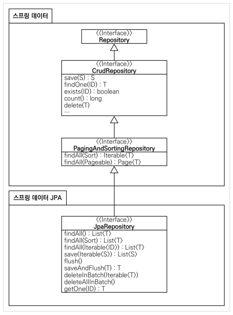

# 스프링 데이터 JPA

## 소개

스프링 데이터 JPA는 스프링 프레임워크에서 JPA 를 편하게 사용할 수 있도록 지원하는 프로젝트이다. 지루하게 반복되는 CRUD 문제를 쉽게 처리하기 위한
공통 인터페이스를 제공한다. 그리고 레포지토리를 개발할 때 인터페이스만 작성하면 실행 시점에 스프링 데이터 JPA 가 구현 객체를 동적으로 생성해 주입해준다.
따라서 인터페이스만 만들어도 개발을 완료 할 수 있다.

공통으로 처리할 수 없는 메소드는 이름을 분석해서 JPQL을 실행한다. `findByUsername(String Username)` -> `SELECT m form Member where username =:username`

### 스프링 데이터 프로젝트

스프링 데이터 JPA는 스프링 데이터 프로젝트의 하위 프로젝트 중 하나이다. 스프링 데이터 프로젝트는 JPA, 몽고 DB, NEO4J, REDIS,
HADOOP 등 다양한 데이터 저장소에 대한 접근을 추상화 해서 개발자 편의 제공하고 데이터 접근 코드를 줄여준다.

## 공통 인터페이스 기능

spring-data-jpa는 spring-data-commmon에 의존하므로 두 라이브러리를 함게 받는다.



주요 메소드는 다음과 같다 (S는 엔티티와 그 자식, T는 엔티티, ID는 엔티티의 식별자 타입)
- save(S) : 메소드는 엔티티에 식별자 값이 없으면 새로운 엔티티로 판단하고 persist()를 호출하고 실별자 값이 있으면 있는 엔티티로 판단해서 merge()를 호출한다. 필요하다면 spring data jpa 기능을 확장해서 신규 엔티티 판단 전략을 변경할 수 있다.
- delete(T) : 내부적으로는 remove()를  호출한다. 엔티티를 삭제한다.
- findOne(ID) : 엔티티를 조회한다. find() 를 호출
- getReference(ID) : proxy 객체를 반환시켜준다. getReference() 를 반환한다.
- findAll(...) : 모든 엔티티 조회, 정렬이나 페이징 조건 파라미터로 제공 할 수 있다.

## 쿼리 메소드 기능
쿼리 메소드 기능은 스프링 데이터 JPA 가 제공하는 기능이다. 스프링 데이터 JPA 가 제공하는 쿼리 메소드 기능은 크게 3가지가 있다.

- 메소드 이름으로 쿼리 생성
- 메소드 이름으로 JPA NamedQuery 호출
- @Query 어노테이션을 사용해서 레포지토리 인터페이스에 쿼리 직접 정의

### 메소드 이름으로 쿼리 생성
정해진 규칙에 따라서 메소드 이름을 짓는 방식, 엔티티 필드명을 그대로 가져와서 쓴다.
```java
List<Member> findByEmailAndName(String email, String name);
```

### JPA NamedQuery

이름 그대로 쿼리에 이름을 부여해서 사용하는 방법, 어노테이션이나 XML에 쿼리를 정의 할 수 있다.

```java
import javax.persistence.Entity;
import javax.persistence.NamedQuery;

@Entity
@NamedQuery(
        name = "Member.findByUsername",
        query = "select m from Member m where m.username =:username"
)
public class Member {
    ...
}
```

이렇게 정의한 Named 쿼리를 JPA 에서 직접 호출하려면 다음과 같이 코드를 작성하면 된다. (스프링 데이터 JPA 사용)

```java
public interface MemberRepository extends JpaRepository<Member, Long>{
    List<Member> findByUsername(@Param("username") String username);
} // spring data jpa 가 아니었다면, em.createNamedQuery("Member.findByUsername", Member.class).getResult ... 해야함.. 
```

### @Query, 리포지토리 메소드에 쿼리 정의
리포지토리 메소드에 직접 쿼리를 정의 할 수 있다.

```java
public interface MemberRepository extends JpaRepository<Member, Long>{
    
    @Query("select m from Member m where m.username = ?1") // native 쿼리라면 nativeQuery=true 를 사용하면 된다.
    List<Member> findByUsername(String username);
} 
```

### 파라미터 바인딩

스프링 데이터 JPA는 위치 기반 파라미터 바인딩과 이름 기반 파라미터 바인딩 모두 지원한다.
```java
select m from Member m where m.username = ?1 // 위치기반
select m from Member m where m.username =:username // 이름 기반
```
코드의 가독성을 위해 이름 기반 파라미터를 사용하도록 하자

### 벌크성 수정 쿼리

```java
// JPA 로 작성된 벌크성 수정 쿼리
int bulkPriceUp(String stockAmount) {
    String qlString = "update Proudct p set p.price = p.price * 1.1" 
        + " where p.stockAmount < :stockAmount";
    
    int resultCount = em.createQuery(qlString)
        .setParameter("stockAmount", stockAmount)
        .executeUpdate();
        }
```

다음은 JPA를 이용한 벌크성 수정 쿼리이다.
```java
@Modifying
@Query("update Proudct p set p.price = p.price * 1.1"
        + " where p.stockAmount < :stockAmount")
int bulkPriceUp(@Param("stockAmount") String stockAmount);
```
스프링 데이터 JPA 에서 벌크성 수정은 Modifying 어노테이션을 사용하면 된다. 


### 반환 타입
결과가 한건 이상이면 컬렉션 인터페이스 사용, 단건이라면 반환 타입 지정한다. 만약 단건으로 지정했는데 여러건이 호출되면 예외 발생한다.
Spring jpa 는 단 건 조회 할 때 결과 값이 없으면 null 을 반환한다.

### 페이징과 정렬
스프링 데이터 JPA 는 쿼리 메소드에 페이징과 정렬을 사용할 수 있게 파라미터를 제공한다. 

```java
Page<Member> findByName(String name, Pageable pageable); // count 쿼리 사용
List<Member> findByName(String name, Pageable pageable); // count 쿼리 사용 안함
```

```java
PageRequest pageRequest = new PageRequest(0, 10, new Sort(Direction.DESC, "name"));

Page<Member> result = memberRepository.findByStartWith("김", pageRequest);

List<Member> members = result.getContent();
int totalPages = result.getTotalPage();
boolean hasNextPage = result.hasNextPage();
```


### JPA 쿼리 힌트
JPA를 사용하면 영속성 컨텍스트에 저장되어 관리되고 flush 하거나 dirty checking 이 가능하다. 하지만 이런 부분을 사용하지 않고 
기능을 이용하려고 한다면 Read Only 쿼리 힌트를 사용하면 된다.
```java

@Repository
public interface MemberRepository extends JpaRepository<Member, Long> {
    @QueryHints(value = @QueryHint(name = "org.hibernate.readOnly", value = "true")) 
    Member findMemberByUsername(String username);
}
```

### Lock 기능

```java
@Repository
public interface MemberRepository extends JpaRepository<Member, Long> {
    @Lock(LockModeType.PESSIMISTIC_WRITE) 
    List<Member> findMembersByUsername(String username);
}
```

## 명세

다양한 검색조건을 조립해서 새로운 검색조건을 만들어내는 기능이라고 생각하면된다. 다만 복잡도가 높아서 실무에서 안쓰이는 것을 추첝

```java
public class MemberSpec {

    public static Specification<Member> teamName(final String teamName) {
        return (Specification<Member>) (root, query, criteriaBuilder) -> {

            if(StringUtils.isEmpty(teamName)) {
                return null;
            }

            Join<Member, Team> t = root.join("team", JoinType.INNER);// 회원과 조인
            return criteriaBuilder.equal(t.get("name"), teamName);
        };
    }

    public static Specification<Member> username(final String username) {
        return (Specification<Member>) (root, query, criteriaBuilder) ->
            criteriaBuilder.equal(root.get("username"), username);
    }
}
```

```java
@Test
public void specBasic() {
    Team teamA = new Team("teamA");
    em.persist(teamA);

    Member m1 = new Member("m1", 0, teamA);
    Member m2 = new Member("m2", 0, teamA);
    em.persist(m1);
    em.persist(m2);

    em.flush();
    em.clear();

    Specification<Member> spec = MemberSpec.username("m1").and(MemberSpec.teamName("teamA"));

    List<Member> result = memberRepository.findAll(spec);

    Assertions.assertThat(result.size()).isEqualTo(1);
}
```

## 사용자 정의 레포지토리 구현
```java
// 기존의 사용자 정의 레포지토리

public interface MemberRepository {
    Member save(Member member);
}

// 사용자 정의 레포지토리

public interface JpaMemberRepository extends JpaRepository<Member, Long>, MemberRepository {
    
}
```


## Web 확장

스프링 데이터 프로젝트는 스프링 MVC에서 사용할 수 있는 편리한 기능을 제공한다. 식별자로 도메인 클래스를 바로 바인딩해주는 도메인 클래스 
컨버터 기능과 페이징 기능이 있다

### 설정
사용하기 위해서는 다음과 같이 어노테이션을 정의한다.
```java
@EnableSpringDataWebSupport
public class WebAppConfig {
    // ...
}
```

### 도메인 클래스 컨버터 기능

도메인 클래스 컨버터는 HTTP로 넘어온 엔티티의 아이디로 객체를 찾아서 바인딩해준다.

```java
@Controller
public class MemberController {
    @Authwired MemberRepository memberRepository;
    
    @RequestMapping("member/memberUpdateForm")
    public String memberUpdateForm(@RequestParam("id") Long id, Model model) {
        Member member = memberRepository.findOne(id);
        model.addAttribute("member", member);
        return "member/memberSaveForm";
    } // 도메인 클래스 컨버터를 적용 안했을 때

    @RequestMapping("member/memberUpdateForm")
    public String memberUpdateForm(@RequestParam("id") Member member, Model model) {
        model.addAttribute("member", member);
        return "member/memberSaveForm";
    } // 도메인 클래스 컨버터를 적용 했을 때
    
}
```

해당 엔티티와 관련된 레포지토리를 통해서 찾는다. 하지만 도메인 클래스 컨버터를 통해서 넘어온 회원 엔티티를 실제로 수정해도 실제 데이터 
베이스에는 반영되지 않는다. 

### 페이징과 정렬기능 

```java
@RequestMapping(value="/members", method=RequestMethod.GET)
public String list(Pageable pageable, Model model) {
    Page<Member> page = memberService.findMembers(pageable);
    model.addAttribute("members", page.getContent());
    return "members/memberList";
        }
```

사용해야할 페이징 정보가 둘 이상이면 접두사로 구분할 수 있다.

```java
@Qualifier("member") Pageable memberPageable,
@Qualifier("order") Pageable orderPageable
```

## 스프링 데이터 JPA 가 사용하는 구현체
JPA 에 있는 SimpleJpaRepository 클래스가 Jpa 구현체이다. 

@Transactional -> JPA의 모든 변경은 트랜잭션 안에서 이루어져야한다. 
또한 readOnly option이 True로 설정되어있는데 약간의 성능향상이 있을 수 있다. 그렇기에 변경이 필요할 때에는 
따로 @Transactional을 서비스에서 걸어주는 것이다.

save() 메소드는 식별자가 null 또는 숫자 값이 0일 때에 새로운 엔티티로 판단해 저장한다. 필요하면 엔티티에 Persistable 인터페이스를 
구현해서 판단 로직을 변경하면 된다.

```java
import java.io.Serializable;

public interface Persistable<ID extends Serializable> extends Serializable {
    ID getId();
    boolean isNew();
}
```

## 스프링데이터 JPA와 QueryDsl 통합

```java
public interface ItemRepository extends JpaRepository<Item, Long>, QueryDslPredicateExcutor<Item> {
    Iterable<T> findAll(Predicate predicate);
}
```

이런식으로 상속받고

```java
QItem item = QItem.item;

Iterable<Item> result = itemRepository.findAll(
        item.name.contains("장난감").and(item.price.between(10000, 20000))
        )
```

위 처럼 사용하면된다. 다만 이런 QueryDslPredicateExcutor는 편리하게 사용이 가능하지만 join, fetch를 사용할 수는 없다.

그렇기에 QueryDslRepositorySupport 를 사용해서 구현해야한다.
