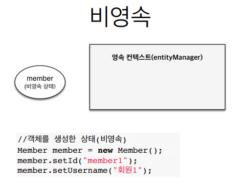
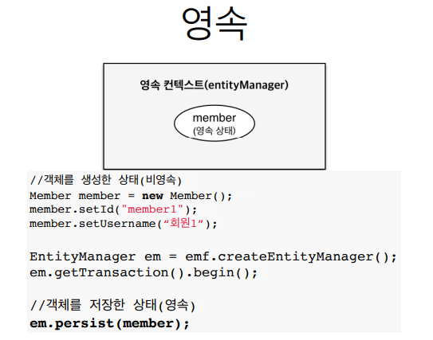
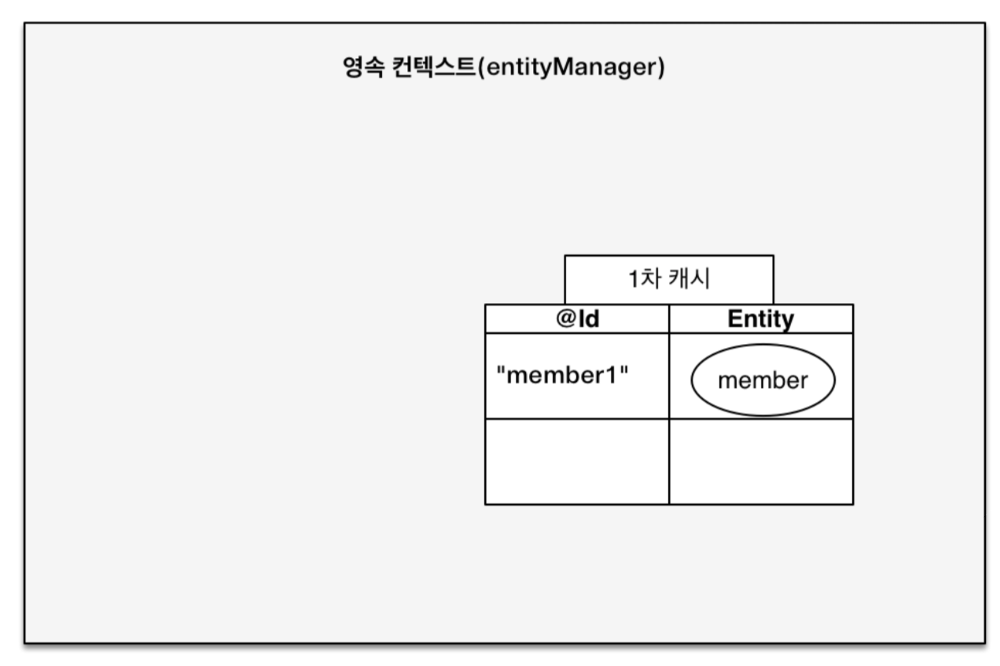
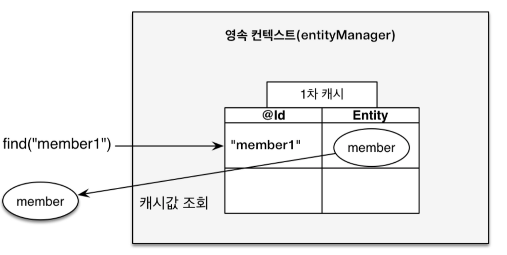
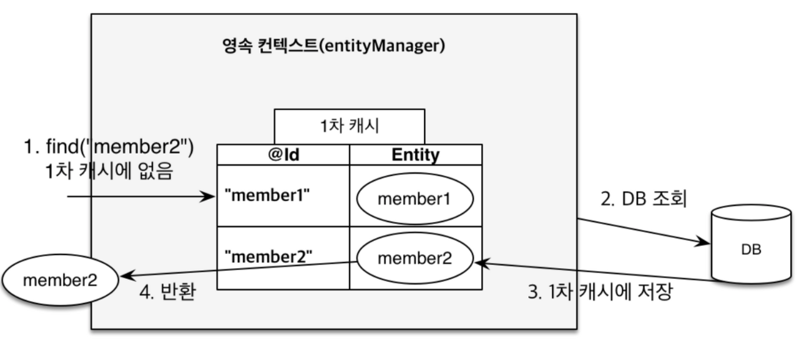
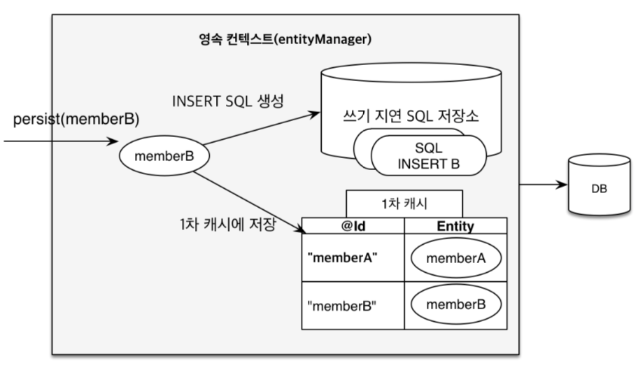
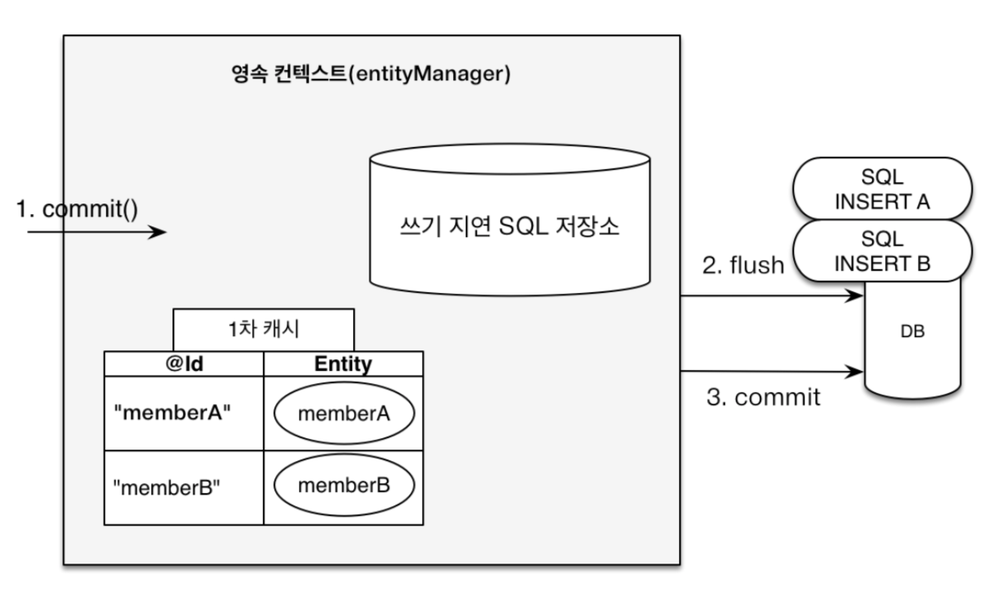
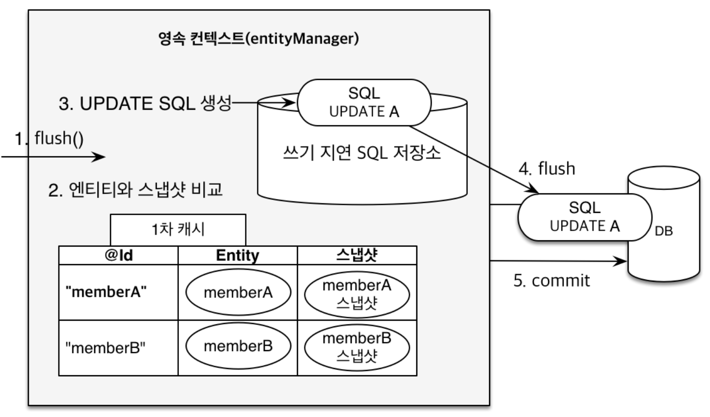
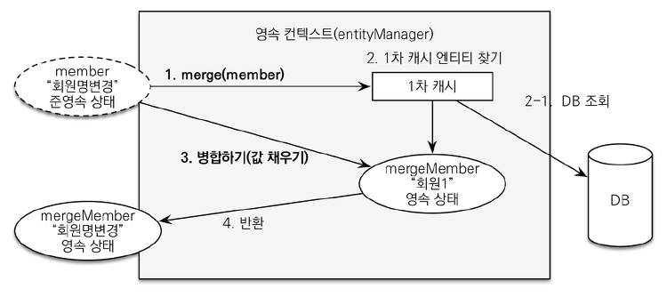

# 영속성 관리

## 엔티티 매니저 팩토리와 엔티티 매니저

엔티티 매니저 팩토리에서 생성한 엔티티 매니저는 데이터베이스 커넥션을 꼭 연결이 필요한 시점까지 커넥션을 얻지 않는다.
예를 들어 트랜잭션이 시작 되었을 때에는 커넥션을 획득한다. 

하이버네이트를 포함한 jpa 구현체들은 팩토리를 생성할 때에 커넥션 풀도 만드는데 (persistence.xml 파일) 이것은 J2SE환경에서 사용
하는 방법이다. JPA를 J2EE 환경(스프링 포함)에서 사용하면 해당 컨테이너가 제공하는 데이터 소스를 사용한다.

*J2SE (Java SE, Standard Edition) : 가장 보편적으로 쓰이는 자바 API 집합체. 일반적인 자바 프로그램 개발을 위한 용도로 사용된다.
AWT나 GUI 방식의 기본 기능이 포함된다.

JAEE (Java EE, Enterprise Edition) : 자바를 이용한 서버측 개발을 위한 플랫폼, 전사적 차원 (대규모의 동시 접속과 유지가 가능한 다양한 시스템의 
연동 네트워크 기반 총칭)에서 필요로하는 도구로 EJB, JSP, Servlet, JNDI 같은 기능을 지원하며 WAS를 이용한 프로그램 개발 시 사용된다.

## 영속성 컨텍스트란?

엔티티를 영구 저장하는 환경. 애플리케이션과 데이터베이스 사이에서 객체를 보관하는 가상의 데이터베이스. `em.persist(member)` 는 엔티티메니저를 이용해 회원 엔티티를 영속성 컨텍스트에 저장한다.
논리적인 개념에 가깝기도 하고 눈에 보이지도 않는다. 영속성 컨텍스트는 엔티티 매니저를 생성할 때 하나 만들어진다. 그리고 엔티티 매니저를 통해
영속성 컨텍스트에 접근 할 수 있고 관리 할 수 있다.

## 엔티티의 생명주기
- 비영속(new) : 영속성 컨텍스트와 전혀 관계가 없는 상태
- 영속(managed) : 영속성 컨텍스트에 저장된 상태
- 준영속(detached) : 영속성 컨텍스트에 저장되어있다가 분리된 상태
- 삭제(removed) : 삭제된 상태


**비영속**

엔티티 객체를 생성했다. 지금은 순수한 객체이다. 아예 영속성 컨텍스트와 데이터베이스와 상관이 없는 상태이다.



**영속**

엔티티 매니저를 통해서 영속성 컨텍스트에 저장했다. 이렇게 영속성 컨텍스트가 관리하는 엔티티를 영속상태라 한다. 
결국 영속 상태라는 것은 영속성 컨텍스트에 의해 관리 된다는 뜻이다.



**준영속**

영속성 컨텍스트가 관리하던 영속 상태의 엔티티를 영속성 컨텍스트가 관리하지 않으면 준영속 상태가 된다.
em.detach()를 호출해서 준영속 상태로 만들 수 있다. 또는 em.close() 나 em.clear() 를 호출해서 영속성 컨텍스트를 초기화 해도 
컨텍스트가 관리하던 영속 상태의 엔티티는 준영속 상태가 된다.

**삭제**

엔티티를 영속성 컨텍스트와 데이터베이스에서 삭제한다. em.remove();

## 영속성 컨텍스트의 특징

- 영속성 컨텍스트와 식별자 값
  - 영속성 컨텍스트는 엔티티를 식별자 값(@Id로 테이블의 기본키와 매핑한 값)으로 구분한다. 따라서 영속 상태는 식별자 값이 반드시 있어야한다.
  - 식별자 값이 없으면 예외를 반환한다. 
- 영속성 컨텍스트와 데이터베이스 저장
  - JPA는 보통 트랜잭션을 커밋하는 순간에 영속성 컨텍스트에 새로 저장된 엔티티를 데이터베이스에 반영한다. (flush)
- 영속성 컨텍스트가 엔티티를 관리를 통한 장점
  - 1차 캐시
  - 동일성 보장
  - 트랜잭션을 지원하는 쓰기 지원
  - 변경 감지
  - 지연 로딩

### 엔티티 조회

영속성 컨텍스트는 내부에 캐시를 가지고 있는데 이를 1차 캐시라고 한다. 영속 상태의 엔티티는 모두 이곳에 저장된다. 영속성 컨텍스트 내부에
Map이 하나 있는데 키는 @Id로 매핑한 식별자고 값은 엔티티 인스턴스이다. 

```aidl
Member member = new Member("member1", "name");
em.persist(member);
```



위 코드를 실행하면 1차 캐시에 회원 엔티티를 저장한다. 아직 DB에는 저장되지 않은 상태이다.
1차 캐시의 키는 식별자 값이다. 그리고 식별자 값은 데이터베이스 기분키와 매핑되어 있다. 따라서 영속성 컨텍스트에 데이터를 저장하고 조회하는
모든 기준은 데이터베이스 기본 키 값이다. 

```aidl
Member member = em.find(Member.class, "member1");
```



find()를 호출하면 우선적으로 1차 캐시에서 식별자 값으로 엔티티를 찾는다. 있다면 데이터베이스를 조회하지 않고 메모리에 있는 1차 캐시에서
엔티티를 조회한다.



값을 호출 했을 때에 1차 캐시에 없으면 엔티티 매니저는 데이터베이스를 조회해서 엔티티를 생성한다. 그리고 1차 캐시에 저장한 후 
영속 상태의 엔티티를 반환한다.

추가적으로 영속성 컨택스트에 있는 1차 캐시에 있는 인스턴스들은 동일성을 보장해준다. 위에서 member1과 member2는 같은 객체로 관리해준다.
그렇기에 영속성 컨텍스트는 성능상 이점과 엔티티의 동일성을 보장한다. 참고로 JPA는 1차 캐시를 통해 REPEATABLE READ 등급의 트랜잭션 
격리 수준을 데이터베이스가 아닌 애플리케이션 차원에서 제공한다는 장점이 있다.

### 엔티티 등록
엔티티 매니저는 트랜잭션을 커밋하기 직전까지 데이터베이스에 엔티티를 저장하지 않고 내부 쿼리 저장소에 INSERT SQL을 차곡차곡 모아둔다.
그리고 트랜잭션을 커밋할 때에 모아둔 쿼리를 데이터베이스에 보내는데 이것을 트랜잭션을 지원하는 쓰기 지연이라 한다.



이후 commit을 하게되면 우선 엔티티 매니저는 영속성 컨택스트를 플러시한다. 플러시는 영속성 컨텍스트를 데이터베이스에 동기화 하는 작업인데,
이때 등록, 수정, 삭제할 엔티티를 데이터베이스에 반영한다. 이를 잘 활용하면 데이터 베이스에 한번에 전달해 성능을 최적화 할 수 있다.



### 엔티티 수정

엔티티의 변경사항을 데이터베이스에 자동으로 반영하는 기능을 변경감지(dirty checking)이라 한다.



JPA는 엔티티를 영속성 컨텍스트에 보관할 때, 최초 상태를 복사해서 저장해 두는데 이것을 스냅샷이라 한다. 그리고 플러시 시점에 스냅샷과 엔티티를 
비교해서 변경된 엔티티를 찾는다. 

1. 트랜잭션을 커밋하면 엔티티 매니저 내부에서 먼저 flush가 호출된다.
2. 엔티티와 스냅샷을 비교해서 변경된 엔티티를 찾는다.
3. 변경된 엔티티가 있으면 수정 쿼리를 생성해서 쓰기 지연 SQL 저장소에 보낸다.
4. 쓰기 지연 저장소의 SQL을 데이터베이스에 보낸다.
5. 데이터베이스 트랜잭션을 커밋한다.

변경 감지는 영속성 컨텍스트가 관리하는 영속 상태의 엔티티에만 적용된다. - 비영속, 준영속처럼 영속성 컨텍스트들은 반영이 안된다.
추가적으로 JPA는 변경되는 엔티티의 모든 필드를 업데이트한다. (데이터 전송량이 많아지긴 하지만 수정 쿼리를 재사용 할 수 있다는 점이 장점이다.)

만약 필드가 많거나 저장되는 내용이 너무 크면 `@org.hibernate.annotation.DynamicUpdate` 옵션을 사용하면 된다. 상황에 따라 다르지만
컬럼이 30개이상이 되어야 위 쿼리가 효과를 볼 가능성이 높다.

### 엔티티 삭제
엔티티 삭제 역시 즉시 삭제가 아니라 쿼리 쓰기 지연 SQL 저장소에 저장한다. 이후 커밋, 플러시를 호출하면 삭제 쿼리를 전달한다.
참고로 remove()를 호출하는 순간에 이미 영속성 컨텍스트에는 값을 삭제한다.

## 플러시

플러시는 영속성 컨텍스트의 변경 내용을 데이터베이스에 반영한다. 영속성 컨텍스트의 내용을 디비에 옮기는 것이 아니라 동기화를 하는 것이다. (삭제가 아니다)

구체적인 절차는 다음과 같다.
1. 변경 감지가 동작해서 영속성 컨텍스트에 있는 모든 엔티티를 스냅샷과 비교해서 수정된 엔티티를 찾는다. 수정된 엔티티는 수정 쿼리를 만들어 쓰기 지연 SQL 저장소에 등록한다.
2. 쓰기 지연 SQL 저장소의 쿼리를 데이터베이스에 전송한다.

호출하는 방법은 3가지이다.
1. em.flush()를 호출하기 - 거의 사용하지 않음
2. 트랜잭션 커밋 시 플러시가 자동으로 호출
3. JPQL 쿼리 실행시 플러시가 자동 호출 (얘는 영속성 처리된 애들이 아직 1차 캐시에만 남아있을 때 찾을 수 없기 때문에 미리 flush를 통해 동기화를 시킨다.)

## 준영속

엔티티가 영속성 컨텍스트에서 분리된 것을 준영속 상태라고 한다. 
분리하는 방법은 3가지이다.
1. em.detach() : 특정 엔티티만 준영속 상태로 전환한다.
2. em.clear() : 영속성 컨텍스트를 완전히 초기화한다.
3. em.close() : 영속성 컨텍스트를 종료한다.

### detach()

1차 캐시부터 쓰기 지연 SQL 저장소까지 해당 엔티티를 관리하기 위한 모든 정보를 제거한다.

### clear()

detach가 특정 하나의 엔티티만 준영속 상태로 만들었다면, clear()는 영속성 컨텍스트를 초기화 해서 해당 영속성 컨텍스트의 모든 엔티티를 
준영속 상태로 만든다.

### close()

영속성 컨텍스트를 종료하면 해당 영속성 컨텍스트가 관리하던 영속성 엔티티가 모두 준영속 상태가 된다. 아예 영속성 컨텍스트가 비어버린다.

### 준영속의 특징
- 사실상 비영속에 가깝다
- 식별자 값을 가지고 있다
- 지연 로딩을 할 수 없다.

### 병합 : merge()

준영속 상태의 엔티티를 다시 영속 상태로 변경하려면 병합을 사용하면 된다. 준영속 상태의 엔티티를 받아서 그 정보로 새로운 영속상태의 엔티티를 반환한다.
(기존의 준영속 상태의 엔티티는 병합 후에도 준영속 상태로 남아있는 것이다.) 물론 비영속 엔티티도 영속 상태로 만드는 것이 가능하다.



